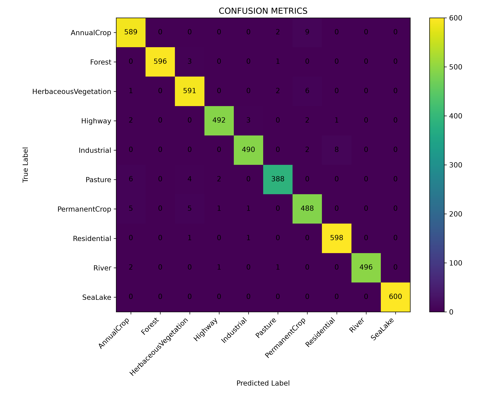
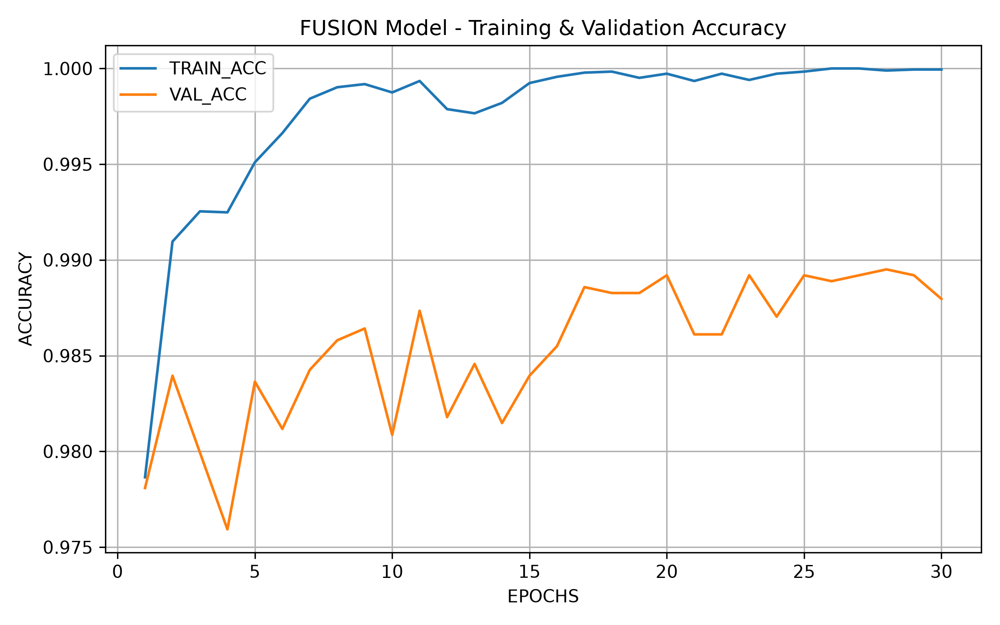
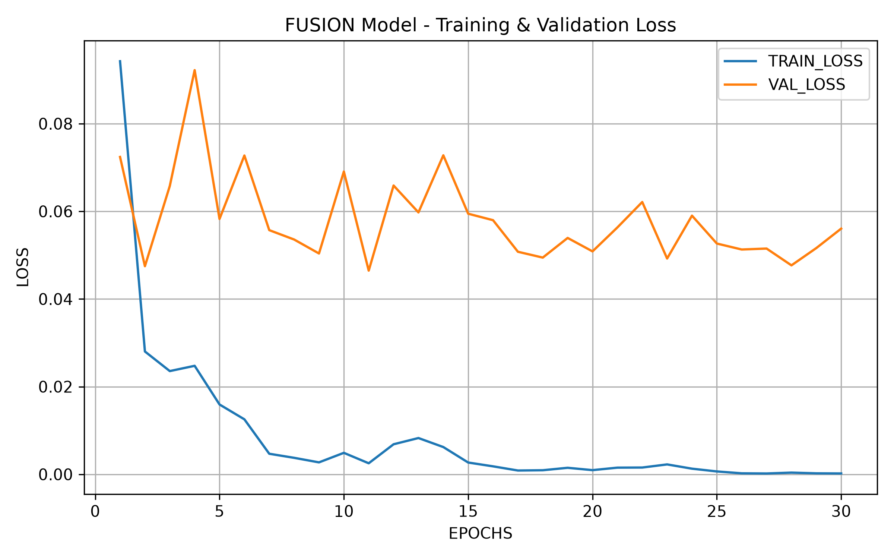

# EuroSAT RGB and Multispectral Classification

This project focuses on land use and land cover classification using the EuroSAT dataset. The aim of the project was to compare different deep learning approaches using RGB and multispectral information from Sentinel-2 satellite images.

The best-performing model was an **intermediate fusion model** , where RGB and spectral features were combined at the feature level before classification.

---

## Dataset

The EuroSAT dataset contains Sentinel-2 satellite images from 10 land cover classes:

- AnnualCrop
- Forest
- HerbaceousVegetation
- Highway
- Industrial
- Pasture
- PermanentCrop
- Residential
- River
- SeaLake

---

## Approach

The following approaches were tested:

- RGB-based classification
- Spectral / multispectral-based classification
- RGB and Spectral Indices 
- Intermediate fusion model

The intermediate fusion model combines RGB and spectral features before the final classification layers. Training the model without freezing allowed the feature extraction layers to be fine-tuned for the EuroSAT dataset.

---

## Best Model Results

| Model | Training Strategy | Accuracy | Macro Precision | Macro Recall | Macro F1-score |
|---|---|---:|---:|---:|---:|
| Intermediate Fusion | Without Freezing | 98.67% | 98.66% | 98.59% | 98.62% |

---

## Class-wise Performance

| Class | Precision | Recall | F1-score | Support |
|---|---:|---:|---:|---:|
| AnnualCrop | 0.9736 | 0.9817 | 0.9776 | 600 |
| Forest | 1.0000 | 0.9933 | 0.9967 | 600 |
| HerbaceousVegetation | 0.9785 | 0.9850 | 0.9817 | 600 |
| Highway | 0.9919 | 0.9840 | 0.9880 | 500 |
| Industrial | 0.9899 | 0.9800 | 0.9849 | 500 |
| Pasture | 0.9848 | 0.9700 | 0.9773 | 400 |
| PermanentCrop | 0.9625 | 0.9760 | 0.9692 | 500 |
| Residential | 0.9852 | 0.9967 | 0.9909 | 600 |
| River | 1.0000 | 0.9920 | 0.9960 | 500 |
| SeaLake | 1.0000 | 1.0000 | 1.0000 | 600 |

---

## Visual Results

### Confusion Matrix

<p align="center">
  
</p>

### Training and Validation Accuracy

<p align="center">
  
</p>

### Training and Validation Loss

<p align="center">
  
</p>

---

## Error Analysis

The model performed strongly across all classes, with the highest performance seen in classes such as **SeaLake**, **Forest**, **River**, and **Residential**.

Most of the remaining errors occurred between visually or spectrally similar classes. Some common confusions were:

- AnnualCrop and PermanentCrop
- HerbaceousVegetation and Pasture
- Industrial and Residential
- Highway and nearby built-up or land regions

These errors are expected because some land cover categories have similar textures, colours, spatial patterns, and spectral characteristics.

---

## Project Structure

```text
EuroSAT/
│
├── data/
├── notebooks/
├── src/
├── results/
│   ├── fusion_confusion_matrix.png
│   ├── fusion_model_acc.png
│   ├── fusion_model_loss.png
│   ├── fusion_test_metrics.csv
│   ├── fusion_classification_report.csv
│   └── fusion_model_history.csv
├── models/
├── requirements.txt
└── README.md
```

## Key Findings

- The **intermediate fusion model** achieved the best performance.
- Combining RGB and spectral information improved land cover classification.
- The model achieved **98.67% test accuracy** and **98.62% macro F1-score**.
- SeaLake achieved perfect classification on the test set.
- Most errors occurred between agricultural and vegetation-related classes.

---

## Future Work

Future improvements could include:

- Comparing early fusion, intermediate fusion, and late fusion in more detail
- Adding Grad-CAM or feature visualisation
- Performing further hyperparameter tuning
- Optimising the model for faster inference

---

## Conclusion

This project demonstrates that fusion-based deep learning can improve satellite land cover classification. The best-performing model was the **intermediate fusion model trained without freezing**, which achieved **98.67% test accuracy** and **98.62% macro F1-score**.

The results show that combining RGB and spectral information at the feature level helps the model learn richer representations than using RGB or spectral information alone. The model performed strongly across all EuroSAT classes, with only a small number of misclassifications between visually and spectrally similar land cover categories.

---

## Citation

The project uses the EuroSAT dataset.

[1] Eurosat: A novel dataset and deep learning benchmark for land use and land cover classification. Patrick Helber, Benjamin Bischke, Andreas Dengel, Damian Borth. IEEE Journal of Selected Topics in Applied Earth Observations and Remote Sensing, 2019.

[2] Introducing EuroSAT: A Novel Dataset and Deep Learning Benchmark for Land Use and Land Cover Classification. Patrick Helber, Benjamin Bischke, Andreas Dengel. 2018 IEEE International Geoscience and Remote Sensing Symposium, 2018.
